# Fancy Device
> Hi. I found this blob on my network traffic, can you help me figure out what it is?

The task gives us this seemingly useless description as well as two files: `firmware.blob` and `unknownbin.zip`. The `file` util tells us that these are both zip archives. 

`unknownbin.zip` contains the files `crypto_key`, `customer_download` and `libdownloadlib.so.0`. `crypto_key` and its contents (32 random bytes) suggest that it is indeed a crypto key, while `customer_download` and `libdownloadlib.so.0` are executable files:
```bash
❯ rabin2 -I customer_download
arch     arm
baddr    0x8000
binsz    73074
bintype  elf
bits     32
canary   false
class    ELF32
crypto   false
endian   little
...
❯ rabin2 -I libdownloadlib.so.0 
arch     arm
baddr    0x0
binsz    42402
bintype  elf
bits     32
canary   false
class    ELF32
compiler GCC: (Linaro GCC 4.8-2013.10) 4.8.2 20131014 (prerelease)
crypto   false
endian   little
...
```

A simple check also confirms that `customer_download` indeed uses `libdownloadlib.so.0` as a library:
```bash
❯ rabin2 -l customer_download
[Linked libraries]
libdownloadlib.so.0
...
```

`firmware.blob`, on the other hand, contains an unrecognizable file called `SDDL.SEC`, and Google seems to tell us that it is a firmware update file for Panasonic TVs, which doesn't sound like something easy to reverse engineer...

Poking around the references to "SDDL.SEC" in `customer_download`:
```bash
❯ rabin2 -z customer_download | grep SDDL    
23  0x0000ebcc 0x00016bcc 28  29   .rodata ascii /usr/local/download/SDDL.SEC
227 0x00010f14 0x00018f14 28  29   .rodata ascii /mnt/sdcard/factory/SDDL.SEC
228 0x00010f34 0x00018f34 36  37   .rodata ascii /tmp/mnt/ustorage%d/factory/SDDL.SEC
```
we find an interesting function at `0xF7B0` which seems to be finding the location of the supposedly downloaded firmware and validating that it actually exists:
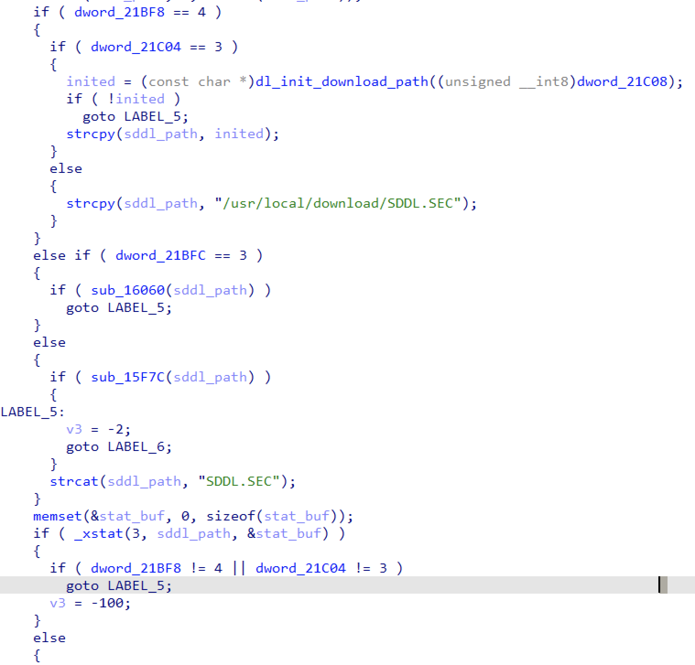

And after some work the rest of the function looks something like this:
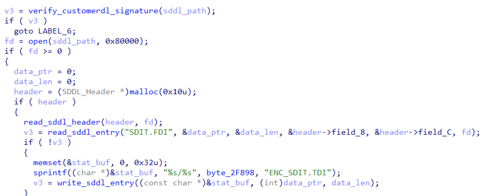

`verify_customerdl_signature` (`0x102D4`) seems to just verify a file's signature using the key at `/usr/local/customer_dl/sig_key`, so `read_sddl_header` (`0xF2C0`) and `read_sddl_entry` (`0xF344`) are much more promising to dig into.

`read_sddl_header` looks something like this:
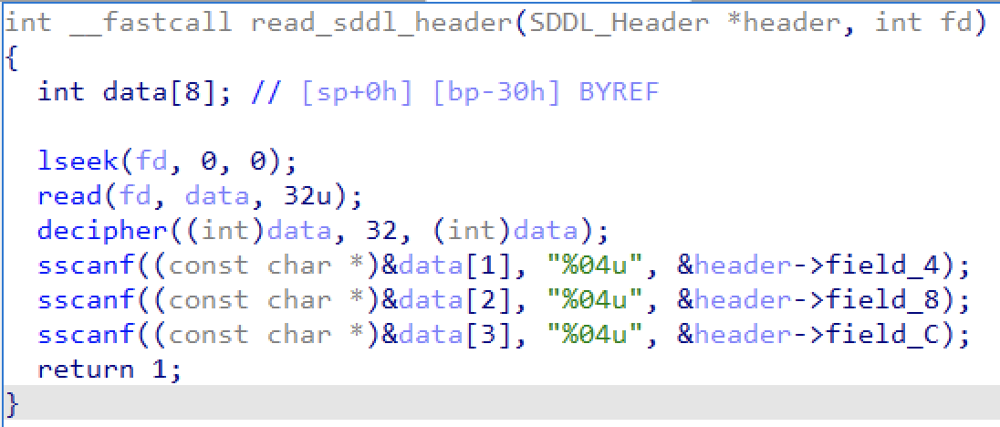
The function looks like it's simply reading an encrypted header, which is why we've given it such a name. But what is this `decipher` function? It is located in `libdownloadlib.so.0`:
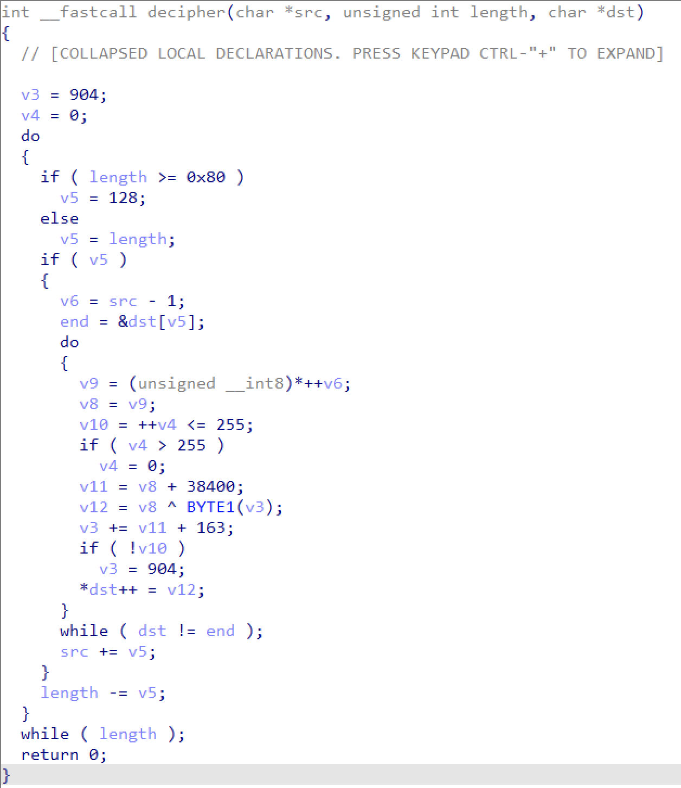

Judging by the code, it's some sort of custom cipher. Let's write it in Python:
```python
def downloadlib_decipher(ct: bytes) -> bytes:
  key = 904
  length = len(ct)
  pt = bytearray()

  n, i = 0, 0
  while length > 0:
    blocksz = min(length, 128)
    for _ in range(blocksz):
      pt.append(ct[i] ^ ((key >> 8) & 0xff))
      key += ct[i] + 38400 + 163

      i, n = i + 1, n + 1
      if n > 255:
        n = 0
        key = 904
    length -= blocksz
  return bytes(pt)

def print_header(sddl):
  data = sddl[:32]
  data = downloadlib_decipher(data)
  print(f"field_4 = {int(data[4:8].decode())}")
  print(f"field_8 = {int(data[8:12].decode())}")
  print(f"field_C = {int(data[12:16].decode())}")
```

And see what the header values are:
```bash
❯ ./solve.py tmp/SDDL.SEC
field_4 = 0
field_8 = 6
field_C = 88
```

These values don't seem to mean much on their own, however, they are passed to
```c
read_sddl_entry("SDIT.FDI", &data_ptr, &data_len, &header->field_8, &header->field_C, fd)
```

`read_sddl_entry` contains code similar to `read_sddl_header`:
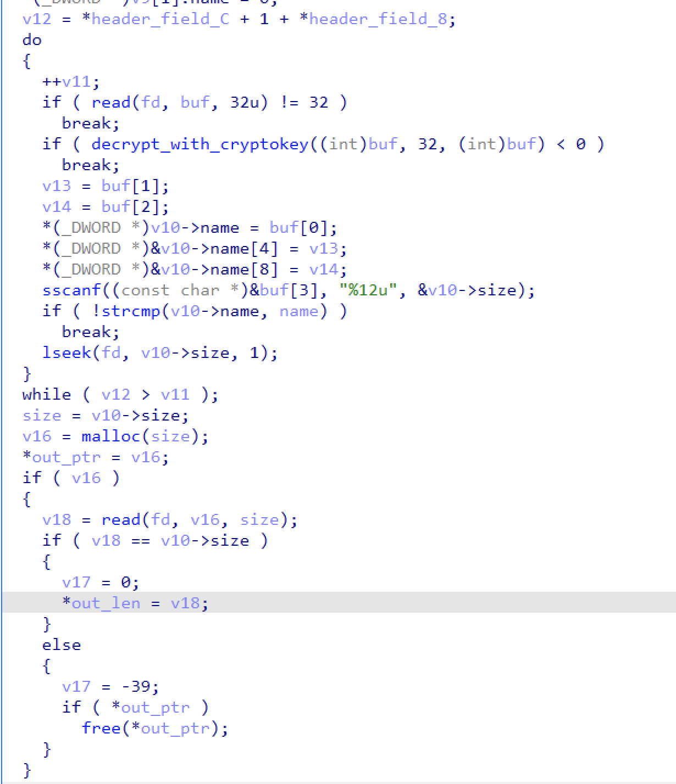

The loop seems to be reading encrypted entry headers in order to find the one requested (`SDIT.FDI` in this case), and the rest of the code is actually reading the data contained inside of the entry. Also, we see how field_8 and field_C are used from the SDDL header - they simply represent the number of different types of entries (thus `field_8 + field_C + 1` gives the total number of entries). However, what does `decrypt_with_cryptokey` (`0x100FC`) do? It doesn't look like the dumb cipher encountered before, and it isn't:
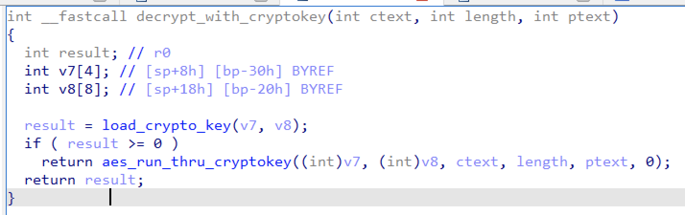

`load_crypto_key` (`0xFC00`) just loads the previously seen crypto key file from `/usr/local/customer_dl/crypto_key` and "decrypts" it using the custom cipher, and `aes_run_thru_cryptokey` (`0xFB38`) simply decrypts the ciphertext using the decrypted `crypto_key` as the key(first 16 bytes) + iv (second 16 bytes) for AES-128-CBC. This is how it looks when rewritten in Python:
```python
class SDDL:
  @dataclass
  class Entry:
    name: str
    data: bytes
    
    @property
    def size(self):
        return len(self.data)

  def __init__(self, sddl: bytes, crypto_key: bytes):
    self.sddl = sddl
    crypto_key = downloadlib_decipher(crypto_key)
    self.key = crypto_key[:16]
    self.iv = crypto_key[16:]
    self.entries = self.read_entries()

  # Decrypts data using the crypto_key
  def decrypt(self, data: bytes) -> bytes:
    aes = AES.new(self.key, AES.MODE_CBC, iv=self.iv)
    return unpad(aes.decrypt(data), 16)
  
  # Returns number of entries in the SDDL
  def read_header(self) -> int:
    data = self.sddl[:32]
    data = downloadlib_decipher(data)
    field_8 = int(data[8:12].decode())
    field_C = int(data[12:16].decode())
    return field_8 + field_C + 1

  def read_entries(self) -> List[Entry]:
    n = self.read_header()
    index = 32
    entries = []
    for _ in range(n):
      header = self.decrypt(self.sddl[index:index+32])
      index += 32
      name = header[:12]
      name = name[:name.index(b'\x00')]
      name = name.decode()
      size = int(header[12:].decode())
      data = self.sddl[index:index+size]
      index += size

      # A guess was made that the data itself is also encrypted and it was correct :) 
      data = self.decrypt(data)
      entries.append(SDDL.Entry(name, data))
    return entries
```

And this gives us the following list of entries:
`SDIT.FDI 000.TXT 001.TXT 002.TXT 003.TXT 004.TXT 005.TXT PEAKS.F00 PEAKS.F01 PEAKS.F02 PEAKS.F03 PEAKS.F04 PEAKS.F05 PEAKS.F06 PEAKS.F07 PEAKS.F08 PEAKS.F09 PEAKS.F10 PEAKS.F11 PEAKS.F12 PEAKS.F13 PEAKS.F14 PEAKS.F15 PEAKS.F16 PEAKS.F17 PEAKS.F18 PEAKS.F19 PEAKS.F20 PEAKS.F21 PEAKS.F22 PEAKS.F23 PEAKS.F24 PEAKS.F25 PEAKS.F26 PEAKS.F27 PEAKS.F28 PEAKS.F29 PEAKS.F30 PEAKS.F31 PEAKS.F32 PEAKS.F33 PEAKS.F34 PEAKS.F35 PEAKS.F36 PEAKS.F37 PEAKS.F38 PEAKS.F39 PEAKS.F40 PEAKS.F41 PEAKS.F42 PEAKS.F43 PEAKS.F44 PEAKS.F45 PEAKS.F46 PEAKS.F47 PEAKS.F48 PEAKS.F49 PEAKS.F50 PEAKS.F51 PEAKS.F52 PEAKS.F53 PEAKS.F54 PEAKS.F55 PEAKS.F56 PEAKS.F57 PEAKS.F58 PEAKS.F59 PEAKS.F60 PEAKS.F61 PEAKS.F62 PEAKS.F63 PEAKS.F64 PEAKS.F65 PEAKS.F66 PEAKS.F67 PEAKS.F68 PEAKS.F69 PEAKS.F70 PEAKS.F71 PEAKS.F72 PEAKS.F73 PEAKS.F74 PEAKS.F75 PEAKS.F76 PEAKS.F77 PEAKS.F78 PEAKS.F79 PEAKS.F80 PEAKS.F81 PEAKS.F82 PEAKS.F83 PEAKS.F84 PEAKS.F85 PEAKS.F86 PEAKS.F87`

`SDIT.FDI` and the `PEAKS.*` files contain some seemingly random binary data, while all of the `*.TXT` files contain the same string:
`"gbl20_neoarch's peaks soft update contents.\n   Current version: $CPKS\n   New version: $NPKS"`. Sadly, none of this seems directly useful...

Looking around for references to the `PEAKS.*` or `*.TXT` files (again using `rabin2 -z ... | grep ...`) a function at `0xF4B0` can be found which reads all of the entries and writes them (their encrypted contents, to be exact) to temporary files:
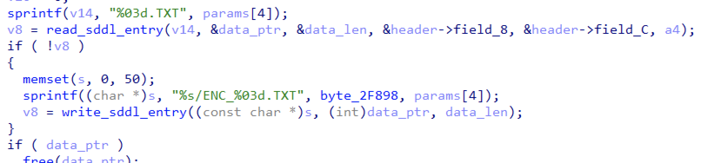
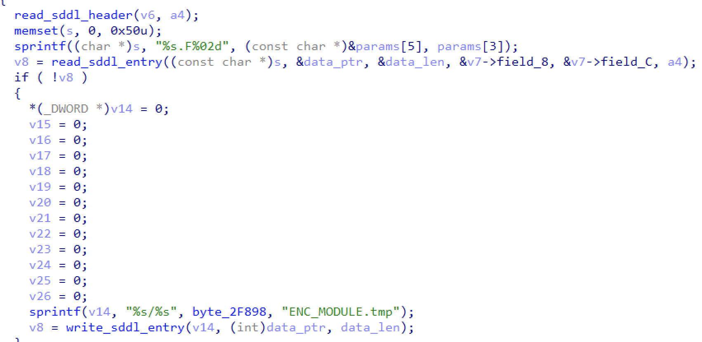

`"ENC_MODULE.tmp"` is then referenced from a function which decrypts and writes it to `"MODULE.tmp"` which, in turn, is referenced from a complex function which parses its header and passes it to some mysterious `dwld_module_exec`:
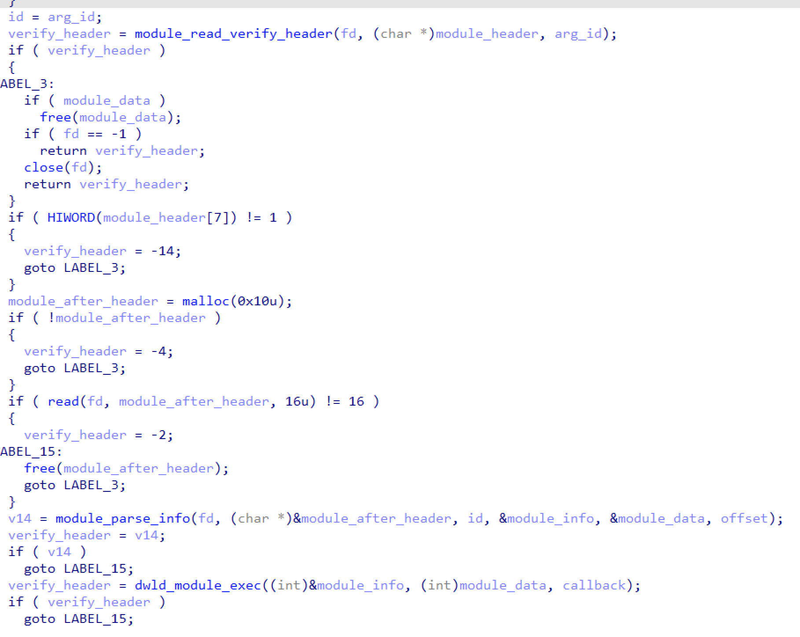

`module_read_verify_header` (`0xE444`) only verifies some header values from the module and its return value as well as `module_header` aren't used anywhere later, so it doesn't seem useful. `module_info`, on the other hand, is filled in by `module_parse_info` (`0xE594`) and then passed to `dwld_module_exec`, so it's definitely worth checking out:
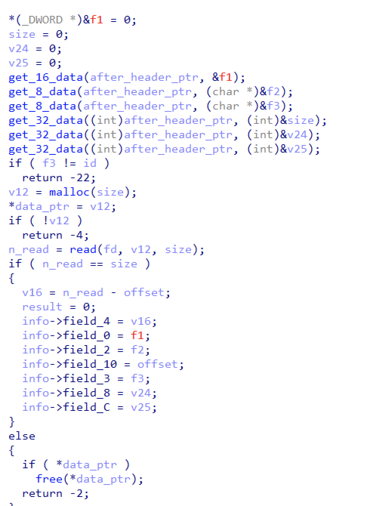

All of the `get_*_data` functions come from `libdownloadlib.so.0` simply extract integer values in big endian. Since `module_read_verify_header` simply reads some values from the module header, lets investigate `dwld_module_exec`, located in `libdownloadlib.so.0`. It looks like this after a bit of reverse engineering:
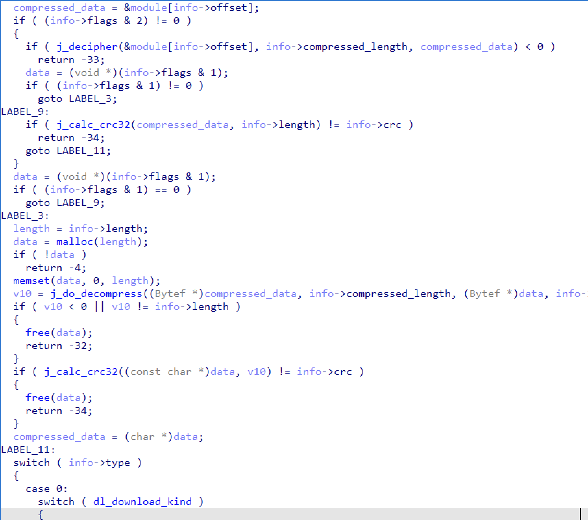

`info` is the info struct extracted during `module_read_verify_header`, and its fields were renamed like this:
```c
struct SDDL_Module_Info
{
  __int16 field_0;
  char flags;
  char type;
  int compressed_length;
  int length;
  int crc;
  int offset;
};
```

`j_decipher` simply calls the infamous `decipher` and `j_do_decompress` uses `zlib` to decompress the data with no special parameters. Since the steps applied to the module's data depend on the value of the module info's `flags` field, now feels like a good time to parse all of this using Python:
```python
    def parse_module(entry, offset):
      # Useless validation header
      # header = entry.data[:32]
      # magic = header[:4]
      # items = [header[4], header[5], header[6], header[7]]
      # items += [u32(header[8:12]), u32(header[12:16]), u32(header[16:20]), u32(header[20:24]), u32(header[24:28])]
      # items += [u16(header[28:30]), u16(header[30:32])]
      # header_items = items
      
      header2 = entry.data[32:32+16]
      items = [u16(header2[:2]), header2[2], header2[3], u32(header2[4:8]), u32(header2[8:12]), u32(header2[12:16])]
      header2_items = items

      info = SDDL.Module.Info(header2_items[0], header2_items[1], header2_items[2], header2_items[3]-offset, header2_items[4], header2_items[5], offset)
      
      assert len(entry.data)==header2_items[3]+48, f"invalid module size: expected {header2_items[3]+48} but got {len(entry.data)}"
      return SDDL.Module(info, entry.data[48:])
```

The flags of all modules are valued at 3, while the type is always 0:
```
PEAKS.F00 flags=3 type=0
PEAKS.F01 flags=3 type=0
PEAKS.F02 flags=3 type=0
PEAKS.F03 flags=3 type=0
PEAKS.F04 flags=3 type=0
PEAKS.F05 flags=3 type=0
PEAKS.F06 flags=3 type=0
PEAKS.F07 flags=3 type=0
PEAKS.F08 flags=3 type=0
PEAKS.F09 flags=3 type=0
PEAKS.F10 flags=3 type=0
PEAKS.F11 flags=3 type=0
PEAKS.F12 flags=3 type=0
...
```

Which, according to `dwld_module_exec`, means that their data will be decrypted and then decompressed before processing. Let's see what the first module looks like after passing it through such pipeline:
```bash
❯ head kek          
@ ?? ??S?
         BW?????e_?g?o??? 
?$"#$??????????????????????????????????????????????????????????????????????????????????????????????????????????????????????????????????????????????????????????????????????????????????????????????????????????????????????????????????????????????????????????????????????????????????????????????????????????A?
?%??,|@$??
?$?A?
?&?@?
     r&?`r&?`r&?`??
??'?;9?


.
 ..

lost+found
...
```

Judging by the `"lost+found"` string contained, it might be a part of some filesystem. Lets check out what `dwld_module_exec` does after extracting this data:
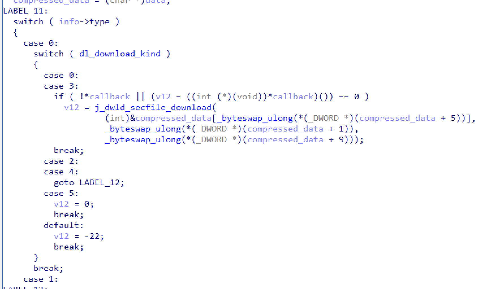

Since the `type` of our modules is 0, `j_dwld_secfile_download` is the function that handles the extracted module data:
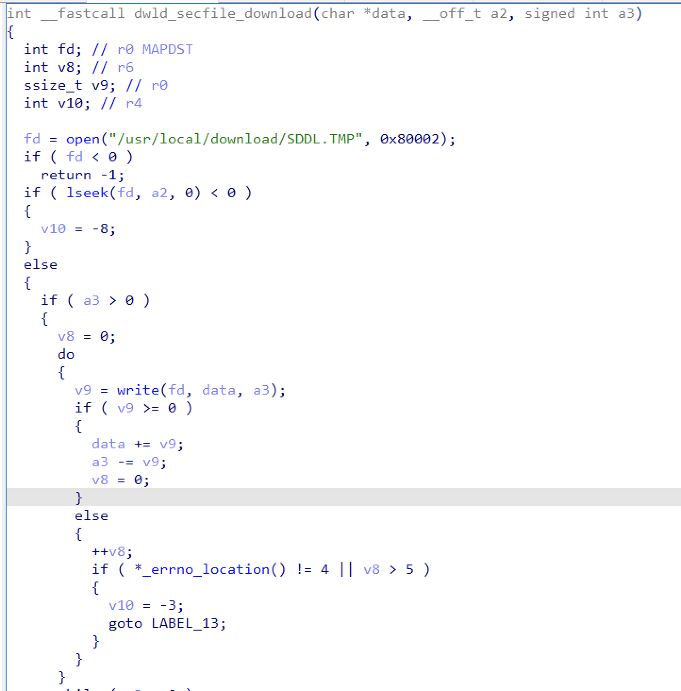

So... all it does is concatenate the data to a single file called `SDDL.TMP`? Looks like it uses some header from the extracted data in order to get the exact offsets, so lets do the same:
```
PEAKS.F00 flags=3 type=0 data_start=14 copy_offset=0 length=4194304
PEAKS.F01 flags=3 type=0 data_start=14 copy_offset=4194304 length=4194304
PEAKS.F02 flags=3 type=0 data_start=14 copy_offset=8388608 length=4194304
PEAKS.F03 flags=3 type=0 data_start=14 copy_offset=12582912 length=4194304
PEAKS.F04 flags=3 type=0 data_start=14 copy_offset=16777216 length=4194304
PEAKS.F05 flags=3 type=0 data_start=14 copy_offset=20971520 length=4194304
PEAKS.F06 flags=3 type=0 data_start=14 copy_offset=25165824 length=4194304
PEAKS.F07 flags=3 type=0 data_start=14 copy_offset=29360128 length=4194304
...
```

Looks like its just copying the extracted data in file order! Here's what `file` has to say:
```bash
❯ file SDDL.TMP 
SDDL.TMP: Linux rev 1.0 ext4 filesystem data, UUID=57f8f4bc-abf4-655f-bf67-946fc0f9f25b (extents) (large files)
```

Running `binwalk -e SDDL.TMP` gives us some goodies:
```bash
❯ ls -al _SDDL.TMP.extracted/squashfs-root 
total 76
drwxr-xr-x 18 renbou renbou 4096 Jun 10 17:49 .
drwxr-xr-x  4 renbou renbou 4096 Jun 27 22:38 ..
drwxr-xr-x  2 renbou renbou 4096 Jun 10 17:49 bin
drwxr-xr-x  5 renbou renbou 4096 Jun 10 17:49 dev
drwxr-xr-x  5 renbou renbou 4096 Jun 10 17:49 etc
drwxr-xr-x  3 renbou renbou 4096 Jun 10 17:49 home
drwxr-xr-x  2 renbou renbou 4096 Jun 10 17:49 lib
lrwxrwxrwx  1 renbou renbou    3 Jun 27 22:38 lib32 -> lib
drwxr-xr-x  2 renbou renbou 4096 Jun 10 17:49 media
drwxr-xr-x  2 renbou renbou 4096 Jun 10 17:49 mnt
drwxr-xr-x  2 renbou renbou 4096 Jun 10 17:49 opt
drwxr-xr-x  2 renbou renbou 4096 Jun 10 17:49 proc
drwx------  2 renbou renbou 4096 Jun 10 17:49 root
drwxr-xr-x  2 renbou renbou 4096 Jun 10 17:49 run
drwxr-xr-x  2 renbou renbou 4096 Jun 10 17:49 sbin
drwxr-xr-x  2 renbou renbou 4096 Jun 10 17:49 sys
drwxrwxrwx  3 renbou renbou 4096 Jun 10 17:49 tmp
drwxr-xr-x  6 renbou renbou 4096 Jun 10 17:49 usr
drwxr-xr-x  4 renbou renbou 4096 Jun 10 17:49 var
-rw-r--r--  1 renbou renbou   35 Jun 10 17:49 flag.txt.zlib
lrwxrwxrwx  1 renbou renbou    9 Jun 27 22:38 init -> sbin/init
lrwxrwxrwx  1 renbou renbou   11 Jun 27 22:38 linuxrc -> bin/busybox
```

And, finally, here is our fabled flag:
```python
import zlib
flag = open("_SDDL.TMP.extracted/squashfs-root/flag.txt.zlib", "rb").read()
print(zlib.decompress(flag))
> b'justCTF{i-love-squashfs-<3}'
```

The whole script to extract `SDDL.TMP` can be found in [solve.py](./solve.py) 